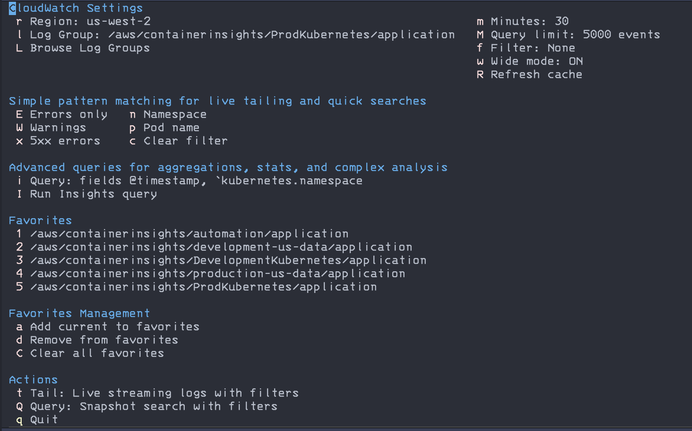
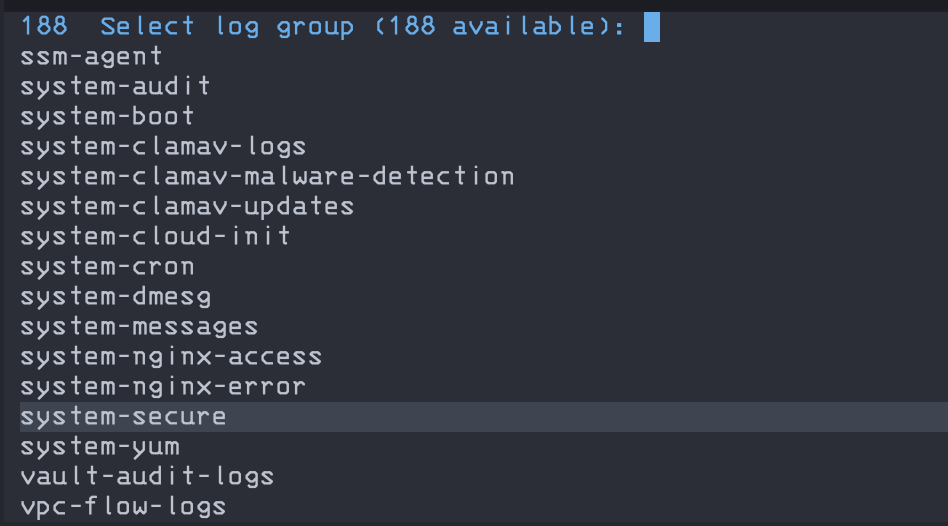
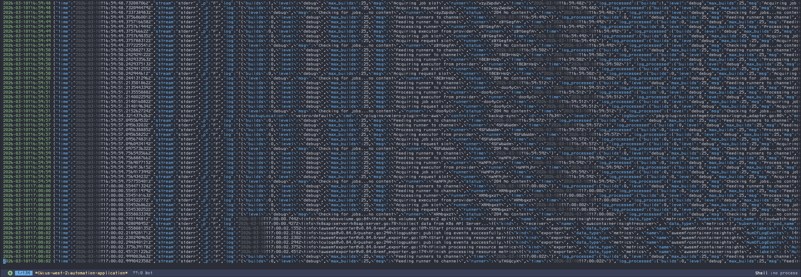

# Cloudwatch-el

## Description

Do you love Emacs? Do you have to work with CloudWatch? Do you find CloudWatch's web UI painful? Do you hate leaving Emacs? Why suffer the indignity of context-switching to a clunky web interface when the *One True Editor* can handle your logs with the elegance and power you deserve? 

This package liberates your CloudWatch logs from the AWS console's tyranny, bringing them home where they belong - inside Emacs. 

This started as a collection of functions I wrote for myself that got a little out of hand as I used them more. I thought they should be made into a proper package and shared in case it could help or inspire anyone else on their emacs journey. 

(This module provides a CloudWatch logs viewer for Emacs with transient interface.)

## Features

- Interactive log browsing with region support
- Live tailing and snapshot queries
- Filter patterns with quick presets
- Favorites management
- Async operations to keep Emacs responsive

## Screenshots

### Transient Interface

*Quick access to all CloudWatch operations through an intuitive menu*

### List and Select Log Groups

*Browse and select from all available log groups in your AWS account*

### Live Log Tailing

*Real-time log streaming with automatic syntax highlighting*

### Advanced Filtering

*Complex JSON field queries to find exactly what you need*

## Prerequisites

- AWS CLI installed and configured
- Valid AWS credentials with CloudWatch access

## Installation

### Vanilla Emacs

```elisp
;; Using straight.el
(straight-use-package
  '(cloudwatch :type git :host github :repo "rand-fu/cloudwatch-el"))

;; Or manually
(add-to-list 'load-path "~/path/to/cloudwatch-el")
(require 'cloudwatch)
(global-set-key (kbd "C-c C") 'cloudwatch)
```

### Doom Emacs

```elisp
;; In packages.el
(package! cloudwatch :recipe (:host github :repo "rand-fu/cloudwatch-el"))

;; In config.el
(use-package! cloudwatch
  :config
  (load! "cloudwatch-doom" (file-name-directory (locate-library "cloudwatch"))))
```

## Configuration

```elisp
;; in ~/.doom.d/config.el
(setq cloudwatch-default-region "us-west-2"
      cloudwatch-favorite-log-groups
     '("/aws/containerinsights/development-eks-cluster/application"
       "/aws/containerinsights/production-eks-cluster/application"
        "/your/custom/log-group"))
```

## Usage

- `SPC o c` - Open CloudWatch transient menu (Doom Emacs)
- `M-x cloudwatch` - Vanilla and anything else

## Transient Commands

- `r` - Change AWS region
- `L` - Browse all log groups
- `l` - Select from favorites
- `t` - Tail logs (live)
- `Q` - Query logs (snapshot)
- `1-5` - Quick select favorites

## Filter Patterns

Filter patterns are powerful but can be confusing. Filters will also vary depending on your own logs and format. Here are some basic examples to get you started.

### Simple Text Filters
```bash
ERROR                     # Find all ERROR messages
"user-123"               # Find specific user ID
Exception                # Find exceptions
"POST /api"              # Find specific API calls
```

### JSON Field Filters (for structured logs)
```bash
{ $.level = "ERROR" }                           # Error level logs
{ $.statusCode >= 500 }                         # 5xx errors
{ $.duration > 1000 }                           # Slow requests (>1s)
{ $.kubernetes.namespace_name = "production" }  # K8s namespace
{ $.kubernetes.pod_name = *api* }               # Pod name containing "api"
{ $.kubernetes.pod_name = nginx-* }             # Pod name starting with "nginx-"
```

### Quick Tips
- Use `$.fieldname` for JSON fields
- Use `*` for wildcards (not `%` like SQL)
- No `like` operator - use `=` with wildcards instead
- Combine conditions with `&&` (AND), `||` (OR)

## Leveraging Emacs Power

CloudWatch-el follows the Unix philosophy - it's just the pipe that brings data into Emacs. Once your logs are in a buffer, you can use all of Emacs' built-in tools:

- `M-x occur` - Find patterns and jump between matches
- `C-s` / `C-r` - Incremental search through results  
- `M-x keep-lines` / `M-x flush-lines` - Further filter the buffer locally
- `C-x r s` - Save regions to registers for comparison
- `M-x write-region` - Export interesting sections
- `M-x clone-indirect-buffer` - View multiple filtered versions side-by-side
- `C-u C-x =` - Inspect characters (useful for debugging encoding issues)

## Optional enhancements for later

- Support for CloudWatch Insights queries (more powerful than filter patterns)
- Save filter history between sessions
- Log stream selection within a log group
