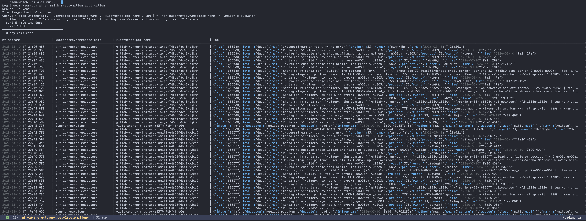

# Cloudwatch-el

## Description

Do you love Emacs? Do you have to work with CloudWatch? Do you hate context-switching to a clunky web interface when the *One True Editor* could handle your logs with the elegance and power you deserve?

This package liberates your CloudWatch logs from the AWS console's tyranny, bringing them home where they belong - inside Emacs. 

This started as a collection of functions I wrote for myself that got a little out of hand as I used them more. I thought they should be made into a proper package and shared for my own education and in case it could help inspire anyone else on their emacs journey. 

(This module provides a CloudWatch logs viewer for Emacs with transient.)

## Features Overview

- Interactive log browsing with region support
- Live tailing and snapshot queries
- Simple filter patterns with quick presets
- Advanced CloudWatch Insights filters
- Favorites management
- Async operations to keep Emacs responsive 

### 🔍 Two Complementary Query Modes 

Because everyone's logs are different.

#### Basic Filters (Quick & Live)
Perfect for real-time troubleshooting and simple pattern matching:
- **Live tailing** - Watch logs stream in real-time
- **Simple filters** - Quick text or JSON field matching
- **Instant results** - No query compilation needed

**Great for:** Debugging active issues, monitoring deployments, watching error streams

#### CloudWatch Insights (Powerful Analytics)
Advanced SQL-like queries for log analysis:
- **Aggregations** - Count, sum, avg, percentiles
- **Time series** - Bin results by time windows
- **Sorting & limits** - Find top/bottom N results
- **Field extraction** - Parse and analyze JSON fields

**Great for:** Post-mortem analysis, performance investigations, usage reports, audits, etc

## Screenshots

### Transient Interface

*Quick access to all CloudWatch operations through an intuitive menu*

### List and Select Log Groups

*Browse and select from all available log groups in your AWS account*

### Live Log Tailing

*Real-time log streaming with automatic syntax highlighting*

### Advanced Filtering

*Complex JSON field queries to find exactly what you need*

### CloudWatch Insights Queries

*Advanced filtering with CloudWatch Insights queries*

## Quick Start

```elisp
;; Install and configure
(use-package cloudwatch
  :custom
  (cloudwatch-default-region "us-west-2")
  (cloudwatch-favorite-log-groups 
    '("/aws/containerinsights/prod/application")))

;; Launch
M-x cloudwatch RET
```

## Prerequisites

- AWS CLI installed and configured
- Valid AWS credentials with CloudWatch access

## Installation

### Vanilla Emacs

```elisp
;; Using straight.el
(straight-use-package
  '(cloudwatch :type git :host github :repo "rand-fu/cloudwatch-el"))

;; Or manually
(add-to-list 'load-path "~/path/to/cloudwatch-el")
(require 'cloudwatch)
(global-set-key (kbd "C-c C") 'cloudwatch)
```

### Doom Emacs

```elisp
;; In packages.el
(package! cloudwatch :recipe (:host github :repo "rand-fu/cloudwatch-el"))

;; In config.el
(use-package! cloudwatch
  :config
  (load! "cloudwatch-doom" (file-name-directory (locate-library "cloudwatch"))))
```

## Configuration 

### Favorites
Save frequently accessed log groups:

```elisp
(setq cloudwatch-favorite-log-groups
      '("/aws/containerinsights/prod/application"
        "/aws/lambda/payment-processor"
        "/aws/ecs/production"))
```

### Insights Presets
Add custom query templates:

```elisp
(add-to-list 'cloudwatch-insights-presets
  '("API latency P99" . 
    "fields @timestamp, duration | stats pct(duration, 99) by bin(5m)"))
```

### Column Widths
Customize Insights result display for your monitor:

```elisp
(setq cloudwatch-insights-column-widths
      '(("@timestamp" . 26)
        ("@message" . 150)  ; Extra wide for ultrawide monitors
        ("log" . 150)
        ("kubernetes.pod_name" . 60)
        (default . 40)))
```

### Query Limits
Adjust default result limits:

```elisp
(setq cloudwatch-query-limit 5000)  ; For basic queries
```

## Usage

- `SPC o c` - Open CloudWatch transient menu (Doom Emacs)
- `M-x cloudwatch` - Vanilla and anything else

## Transient Commands

### Settings
- `r` - Change AWS region
- `l` - Select log group (favorites + custom)
- `L` - Browse all log groups in region
- `m` - Set minutes to look back
- `M` - Set query result limit
- `f` - Set filter pattern
- `w` - Toggle wide mode for Insights results
- `R` - Refresh log groups cache

### Quick Filters
- `E` - Filter errors only
- `W` - Filter warnings
- `5` - Filter 5xx errors
- `n` - Filter by Kubernetes namespace
- `p` - Filter by pod name
- `c` - Clear all filters

### CloudWatch Insights
- `i` - Set/select Insights query (presets + custom)
- `I` - Execute Insights query

### Favorites
- `1-5` - Quick select from favorite log groups
- `a` - Add current log group to favorites
- `d` - Remove a log group from favorites
- `C` - Clear all favorites

### Actions
- `t` - Tail logs (live streaming with filters)
- `Q` - Query logs (snapshot with filters)
- `q` - Quit transient menu

### In Results Buffers
- `RET` - View full log entry detail (Insights results)
- `SPC` - View full log entry detail (alternative)
- `g` - Rerun query/refresh results
- `+` - Increase query limit and rerun
- `-` - Decrease query limit and rerun
- `q` - Close buffer

## Usage Examples

### Basic Filtering

```elisp
;; Quick error search
M-x cloudwatch RET
E                         ; Filter for ERROR
t                         ; Start tailing

;; Pod-specific logs
M-x cloudwatch RET
p                         ; Set pod filter
my-app-pod-*             ; Use wildcards!
Q                         ; Query snapshot
```

### CloudWatch Insights Queries

```elisp
;; Analyze error patterns
M-x cloudwatch RET
i                         ; Set Insights query
"Errors by count"         ; Select from presets
I                         ; Run query

;; Custom analysis
M-x cloudwatch RET
i                         ; Set Insights query
"Custom query"            ; Choose custom
fields @timestamp, @message | filter @message like /timeout/ | stats count() by bin(5m)
I                         ; Run query
```

### Interactive Results

After running an Insights query:
- **RET** on any row - View full log entry with pretty-printed JSON
- **g** - Rerun the query
- **q** - Close results

## Tips & Tricks

- **Combine both modes**: Use Insights to identify problem time ranges, then use filtered tailing to watch those specific issues
- **Save complex queries**: Add frequently-used Insights queries to your presets
- **Use the @ptr field**: Reference specific logs in bug reports or for AWS Console cross-reference
- Use `$.fieldname` for JSON fields

### Leveraging Emacs Power

CloudWatch-el follows the Unix philosophy - it's just the pipe that brings data into Emacs. Once your logs are in a buffer, you can use all of Emacs' built-in tools:

- `M-x occur` - Find patterns and jump between matches
- `C-s` / `C-r` - Incremental search through results  
- `M-x keep-lines` / `M-x flush-lines` - Further filter the buffer locally
- `C-x r s` - Save regions to registers for comparison
- `M-x write-region` - Export interesting sections
- `M-x clone-indirect-buffer` - View multiple filtered versions side-by-side
- `C-u C-x =` - Inspect characters (useful for debugging encoding issues)

## Troubleshooting

### No log groups appearing
- Check AWS credentials: `aws sts get-caller-identity`
- Verify region: Logs might be in a different region
- Refresh cache: Press `R` in the transient

### Insights queries timing out
- Reduce time range (use fewer minutes)
- Add more specific filters to reduce data scanned
- Check CloudWatch Insights query limits in AWS

### Performance issues with large results
- Use Insights for aggregations instead of fetching all events
- Reduce `cloudwatch-query-limit` for basic queries
- Use time and filter constraints to limit data

## Contributing

Contributions welcome! Please feel free to submit issues and pull requests.

## License

GPL-3.0 - See LICENSE file for details.
